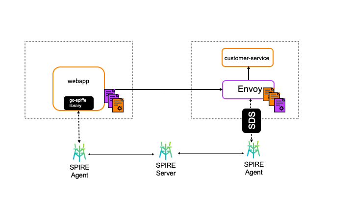

# App using go-spiffe to envoy

This demonstration shows a go application using the go-spiffe library to
make requests to a backend service. The backend service uses an envoy proxy.

This shows how SPIFFE/SPIRE can be leveraged at different layers within an
application. If an application cannot be modified to use a native SPIFFE
library, envoy can be used.

For this demo, the `webapp` application, written in `go`, uses the native
go-spiffe library.

The `customer-service` backend application is simply `nginx` serving static
content, with envoy as a proxy to handle SVIDs.

[TODO: Add additional flavor about this demo, the reasons for this use-case,
etc.]

[TODO: Add links to other relevant documentation]

[TODO: Improve (redo) the diagram]

