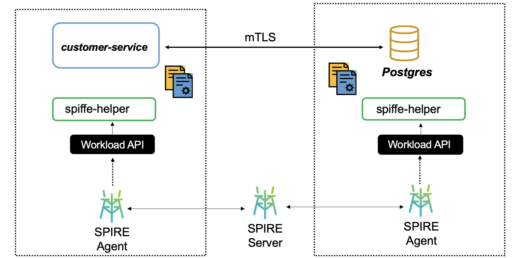

# Postgres with SVID auth

This demonstration shows the use of an SVID to enable a service to connect to
a postgres database using TLS client certificates. SPIRE, with the help of the
`spiffe-helper` sidecar handles workload attestation, as well as generation and
rotation of the TLS certificates.

This is run inside a Kubernetes cluster using SAT node attestation, however the
SPIRE configuration is beyond the scope of this demo aside from performing the
necessary steps to deploy SPIRE into the cluster and to create the node and
workload attestion entries.

[TODO: Add additional flavor about this demo, the reasons for this use-case,
the value prop, etc.]

[TODO: Add links to other relevant documentation]

[TODO: Improve (redo) the diagram]

